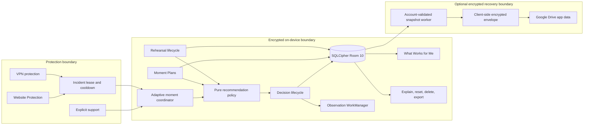

# Private Moment Loop architecture

## Status legend

| Status | Meaning |
|---|---|
| Implemented | Present in the current local source tree. |
| Tested | Covered by an automated JVM or Android instrumented test. |
| Manually verified | Verified by a person on a device. No item has this status in this document. |
| Planned | Research or product work only; not present in the application. |

## Loop

The Private Moment Loop is an on-device support lifecycle:

1. **Prepare:** the user creates a Moment Plan and may practise it through a guided or quick rehearsal.
2. **Notice:** Website Protection, VPN protection, or an explicit support request identifies a difficult moment. Protection incident tokens are deduplicated before a decision is created.
3. **Pivot:** the policy selects from eligible support families. Assignment and the user's actual choice are stored separately.
4. **Act:** the chosen Short Pause, Pivot Game, Reset Reading, or Moment Plan records presentation, start, completion, or dismissal through explicit lifecycle calls.
5. **Learn:** optional feedback and a bounded 20-minute repeat observation add factual outcome evidence. Completed rehearsal history can break equal-plan ties and can later be linked to same-plan, same-revision use.
6. **Understand and Control:** What Works for Me summarizes thresholded facts. The explanation screen, per-family controls, reset, full Moment-data deletion, export, and encrypted recovery give the user control.

All six stages are implemented. Automated coverage exists for their domain and persistence contracts. Physical-device automation is recorded in the verification receipt. The separate manual plan remains outstanding.

## Components

## Data flow

1. A protection source supplies a bounded, opaque incident token and a generic source kind. Raw URLs, domains, package identity, page titles, search text, notification text, and journal text are not adaptive decision columns.
2. The coordinator checks the current 20-minute moment window and the unique incident-token constraint.
3. The policy consumes preferences, eligible families, limited finalized evidence, enabled plans, and recent completed rehearsals. It returns a deterministic assignment record except for the existing controlled 25/75 exploration source.
4. Persistence records the assigned suggestion separately from the actual intervention.
5. Lifecycle writes are idempotent and enforce exclusive completion or dismissal.
6. WorkManager finalizes or reschedules the repeat-observation deadline independently of intervention navigation.
7. The dashboard observes Room flows and builds factual, privacy-filtered summaries in memory.
8. Adaptive table invalidations request the existing unique restore-snapshot worker. The worker writes only after authenticated UID and ownership checks; the cloud worker is requested only after a confirmed local snapshot write.

## Boundaries

### Encryption boundary

- Adaptive tables live in the existing SQLCipher Room database.
- Automatic/cloud recovery reuses the existing client-side encrypted recovery envelope.
- Manual backup reuses AES-256-GCM with the existing password-derived key contract.
- No adaptive record is stored in unencrypted DataStore.
- Encryption keys never appear in export or restore payload data.

### Protection boundary

- Detection, incident lease, cooldown, VPN state, and monitoring remain outside the adaptive policy.
- The adaptive layer receives only the minimum generic context it needs.
- Failure to persist or present adaptive support falls back to the established protection behavior.
- No restored decision reopens a protected source or navigates directly into an intervention.

### Lifecycle boundaries

- Rehearsal is not a protection incident, decision, feedback event, repeat observation, or points event.
- A decision has distinct assigned, actual, presented, started, completed, dismissed, feedback, and observation states.
- Completion and dismissal are mutually exclusive.
- An interrupted restored rehearsal becomes dismissed history at restore time; transient practice navigation is not resumed.
- A deleted plan is not recreated from historical rehearsal or decision references.

### No-cloud behavioural-data boundary

- No Firebase behavioural collection was added.
- No analytics event containing plans, decisions, rehearsal history, feedback, cues, or urge ratings was added.
- Encrypted recovery is user-enabled storage, not a behavioural model or analytics pipeline.
- Ownership uses authenticated UID and the existing verified Google subject-hash path, never email.

## Failure and recovery

### Failure fallback

- Invalid models fail before persistence.
- Duplicate incident and entity IDs are rejected or handled idempotently.
- A failed late restore insert rolls the Room transaction back.
- Invalid or partial adaptive restore sections reject the complete import.
- Snapshot workers decline invalid account, ownership, onboarding, and backup states.
- UI errors remain generic and do not expose exception text or private content.

### Process-death recovery

- Rehearsal routes carry only an opaque UUID; the ViewModel reloads the Room event and current plan.
- Adaptive decisions are reloaded by decision UUID.
- Application startup finalizes overdue observations and reschedules future deadlines.
- Dashboard state is rebuilt from Room flows.
- Pending feedback is derived from persisted lifecycle state and still passes app-lock and active-intervention safety checks.
- No persistent adaptive-navigation payload exists, so restore cannot navigate into an old intervention.

## Test architecture

- Pure JVM tests exercise validation, recommendation, rehearsal, later-use matching, insight thresholds, explanation/privacy source policy, reset behavior, restore codec rules, and regression contracts.
- Room instrumented tests exercise SQLCipher opening, migration 8 to 9, constraints, idempotence, deletion survival, dashboard queries, reset transactions, and adaptive restore transactions.
- Exact Samsung classes verify the new database and lifecycle behavior on an SM-S928B.
- The 56-item manual plan covers visual, accessibility, protection, process, reboot, retention, privacy, migration, and end-to-end reviewer evidence. Those checks are not marked passed by automation.

## V28 hardening additions

- Room 10 adds exact plan/rehearsal content revisions, recommendation-policy and protocol passport fields, eligible-plan count, screen privacy, and retention preference through explicit migration 9 to 10.
- Every executable intervention is resolved through the nine-contract version-1 protocol registry.
- What Works for Me labels evidence as count-only, early pattern, or comparison-supported and recalculates after retention or reset.
- Decision explanations are UUID-addressed Room receipts, not transient dialogs.
- Sensitive adaptive routes use preference-controlled secure-window handling with an opaque transition layer.
- Bounded retention protects open or active records and coordinates observation recovery, WorkManager cancellation, and snapshot refresh.
- Policy replay is pure and deterministic. Its only fixture surface is in `src/debug`; release navigation has no route to it.
- The automatic bundle remains outer format 3. New adaptive data is schema 2, while adaptive schema 1 and bundles without adaptive data remain restorable.

## Planned, not implemented

Private Learning Network research, Moment Protocol Studio, organisation dashboards, clinical systems, passive diagnosis, camera or microphone inference, and large-language-model coaching are not part of this implementation. See the future platform roadmap.

## PathShift closed-loop extension

Room 11 adds an optional fixed forecast cycle without redesigning the Private Moment Loop. A deliberate PathShift snapshot references the existing root incident history and an exact Moment Plan revision. Existing live decisions supply factual Started, Completed, Dismissed, Wrong Timing, and final repeat records. The later review remains non-causal. Adaptive recovery advances to schema 3 while schemas 1 and 2 remain readable. See `V28_PATHSHIFT_ARCHITECTURE.md`.
# Protection Coach connection

Protection Coach extends the Private Moment Loop without changing the adaptive assignment boundary. It treats onboarding answers as broad setup intent, genuine root protected moments as encrypted on-device evidence, and user-approved schedule/support changes as explicit configuration outcomes. No recommendation is applied silently, and no protected source identity, journal text, account identifier, browser history, or diagnosis enters the recommendation ledger.
